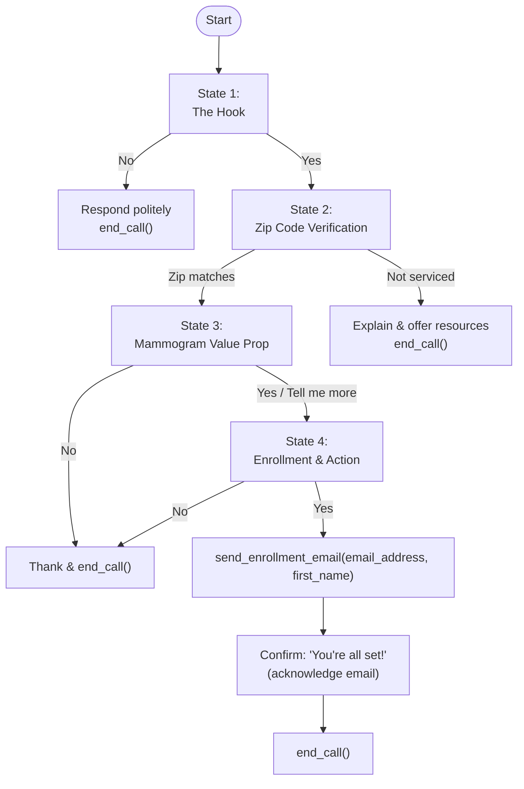
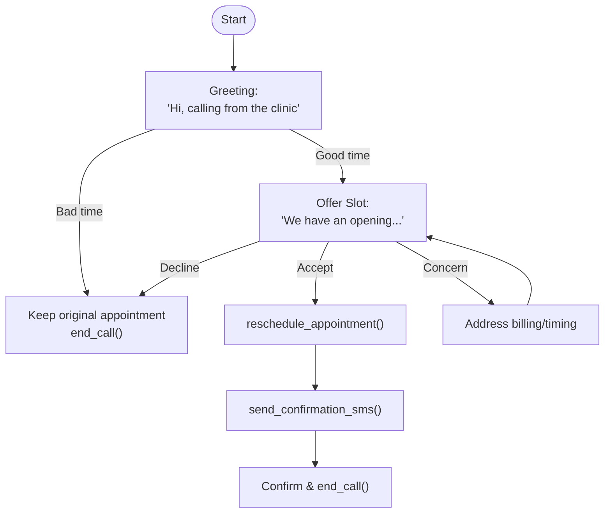

# VakLab - Multi-Campaign Voice AI Agent Platform

Enterprise-grade Voice AI Agent Framework built with Google Cloud AI, Pipecat, and Twilio for automated outbound calling campaigns.

## 🎯 Overview

VakLab is an intelligent Voice AI platform that makes outbound calls for multiple healthcare campaigns. The platform uses a **modular orchestrator pattern** that routes calls to campaign-specific agents:

### Supported Campaigns

| Campaign | Agent | Purpose | Tools |
|----------|-------|---------|-------|
| **HEDIS Gap Closure** | MetnaAgent | Breast cancer screening rewards enrollment | `send_enrollment_email`, `end_call` |
| **Appointment Backfill** | SchedulingAssistant | Fill cancelled appointment slots | `reschedule_appointment`, `send_confirmation_sms`, `end_call` |

### Technology Stack
- **Google Gemini 2.0 Flash** for natural language understanding and generation
- **Google ADK** for agent development and evaluation framework
- **Google Cloud Speech-to-Text** for real-time transcription
- **Google Cloud Text-to-Speech** for natural voice synthesis
- **Pipecat AI** for real-time audio pipeline processing
- **Twilio** for telephony infrastructure (voice + SMS)

---

## 🏗️ Architecture

```
┌─────────────────────────────────────────────────────────────────────────────┐
│                              VakLab Architecture                             │
└─────────────────────────────────────────────────────────────────────────────┘

                                    ┌─────────────┐
                                    │   Member    │
                                    │   Phone     │
                                    └──────┬──────┘
                                           │
                                           ▼
                              ┌────────────────────────┐
                              │        Twilio          │
                              │   (Voice Platform)     │
                              └────────────┬───────────┘
                                           │ WebSocket
                                           ▼
┌──────────────────────────────────────────────────────────────────────────────┐
│                           FastAPI Server (Port 8000)                         │
├──────────────────────────────────────────────────────────────────────────────┤
│                                                                              │
│  ┌─────────────────┐    ┌─────────────────────────────────────────────────┐ │
│  │  /twilio/       │    │              Pipecat Pipeline                   │ │
│  │  outbound-call  │───▶│                                                 │ │
│  │  (Trigger)      │    │  ┌─────────┐   ┌─────────┐   ┌─────────────┐   │ │
│  └─────────────────┘    │  │ Google  │   │ Google  │   │   Google    │   │ │
│                         │  │  STT    │──▶│  LLM    │──▶│    TTS      │   │ │
│  ┌─────────────────┐    │  │(Speech) │   │(Gemini) │   │  (Voice)    │   │ │
│  │  /twilio/       │    │  └─────────┘   └─────────┘   └─────────────┘   │ │
│  │  voice-entry    │    │                     │                          │ │
│  │  (TwiML)        │    │              ┌──────┴──────┐                   │ │
│  └─────────────────┘    │              │   Tools     │                   │ │
│                         │              ├─────────────┤                   │ │
│  ┌─────────────────┐    │              │ Campaign Tools:   │                   │ │
│  │  /twilio/       │    │              │ • send_email      │                   │ │
│  │  stream         │◀──▶│              │ • reschedule_appt │                   │ │
│  │  (WebSocket)    │    │              │ • send_sms        │                   │ │
│  └─────────────────┘    │              │ • end_call        │                   │ │
│                         │              └───────────────────┘                   │ │
│  │  (WebSocket)    │    │                                                 │ │
│  └─────────────────┘    └─────────────────────────────────────────────────┘ │
│                                                                              │
└──────────────────────────────────────────────────────────────────────────────┘
                                           │
                                           ▼
                              ┌────────────────────────┐
                              │     PostgreSQL DB      │
                              │  (Member Data Store)   │
                              └────────────────────────┘
```

### Orchestrator Pattern

```
┌─────────────────────────────────────────────────────────────┐
│                   OutboundOrchestrator                      │
│  • Detects campaign type from session.app_name              │
│  • Loads campaign-specific context from database            │
│  • Instantiates appropriate agent dynamically               │
└─────────────────────────────────────────────────────────────┘
                              │
              ┌───────────────┼───────────────┐
              ▼               ▼               ▼
    ┌─────────────────┐ ┌─────────────────┐ ┌─────────────────┐
    │   MetnaAgent    │ │SchedulingAssist│ │  [Future Agent] │
    │   (HEDIS)       │ │  (Appointment)  │ │                 │
    └─────────────────┘ └─────────────────┘ └─────────────────┘
```

---

## 📞 Call Flow Diagrams

### HEDIS Campaign (Mammogram Screening)


### Appointment Backfill Campaign



---

## 🔄 Sequence Diagram

```
┌──────┐   ┌────────┐   ┌────────┐   ┌────────────┐   ┌──────────┐   ┌────────┐
│User  │   │ Twilio │   │ FastAPI│   │Orchestrator│   │CampaignAgt│  │ Tools  │
└──┬───┘   └──┬─────┘   └──┬─────┘   └────┬───────┘   └────┬─────┘   └──┬─────┘
   │           │            │              │               │            │
   │  Answer   │            │              │               │            │
   │──────────▶│            │              │               │            │
   │           │  Webhook   │              │               │            │
   │           │──────────▶│  POST /outbound-call  ──────▶│            │
   │           │            │─────────────▶│ _get_member_data│         │
   │           │            │              │──────────────▶│ instantiate Metna
   │           │            │              │               │   run_live │
   │           │            │              │               │──────────▶│
   │           │            │              │  "Hi {first_name}..."       │
   │◀──────────│            │              │◀──────────────│            │
   │  Speech   │            │              │   (TTS/STT via Pipecat)      │
   │  Reply    │            │              │──────────────▶│            │
   │──────────▶│            │              │   (zip code provided)       │
   │           │            │              │──────────────▶│            │
   │           │            │              │  (If enroll)  │ send_enrollment_email
   │           │            │              │──────────────▶│──────────▶│
   │           │            │              │               │   email sent│
   │           │            │              │  end_call()   │──────────▶│
   │   Hangup  │            │              │──────────────▶│            │
```

---

## 🛠️ Tech Stack

| Component | Technology |
|-----------|------------|
| **Framework** | FastAPI + Pipecat AI |
| **LLM** | Google Gemini 2.0 Flash |
| **Agent Framework** | Google ADK (Agent Development Kit) |
| **Speech-to-Text** | Google Cloud STT |
| **Text-to-Speech** | Google Cloud TTS (Journey-F voice) |
| **Voice Activity Detection** | Silero VAD |
| **Telephony** | Twilio Voice |
| **Database** | PostgreSQL |
| **Tunnel** | ngrok |

---

## 📋 Prerequisites

1. **Python 3.12+**
2. **Docker & Docker Compose** (for PostgreSQL)
3. **ngrok account** (for public URL tunnel)
4. **Google Cloud Account** with:
   - Cloud Speech-to-Text API enabled
   - Cloud Text-to-Speech API enabled
   - Gemini API key
   - Service account JSON credentials
5. **Twilio Account** with:
   - Account SID
   - Auth Token
   - Phone number

---

## 🚀 Setup Instructions

### Step 1: Clone and Setup Environment

```bash
# Navigate to project directory
cd /path/to/gcp_hackthon

# Create virtual environment
python3.12 -m venv venv

# Activate virtual environment
source venv/bin/activate

# Install dependencies
pip install -r requirements.txt

# Install Pipecat with Google and Silero extras
pip install "pipecat-ai[google,silero]"
```

### Step 2: Configure Environment Variables

Create a `.env` file in the project root:

```env
# Google Cloud
GOOGLE_API_KEY=your_google_api_key
GOOGLE_GENAI_USE_VERTEXAI=0

# Database
DB_HOST=localhost
DB_NAME=outbound_agent_db
DB_USER=user
DB_PASSWORD=password

# SMTP (for sending emails)
SMTP_SERVER=smtp.gmail.com
SMTP_PORT=587
SMTP_USER=your_email@gmail.com
SMTP_PASSWORD=your_app_password

# Twilio
TWILIO_SID=your_twilio_account_sid
TWILIO_AUTH=your_twilio_auth_token
TWILIO_NUMBER=+1234567890

# Domain (ngrok URL - update after starting ngrok)
DOMAIN=https://your-ngrok-url.ngrok-free.app
```

### Step 3: Setup Google Cloud Credentials

1. Create a service account in Google Cloud Console
2. Download the JSON credentials file
3. Place it in the project root
4. Update the path in `routers/pipe_bot.py` if needed

### Step 4: Start PostgreSQL Database

```bash
# Start the database container
docker compose up -d

# Verify it's running
docker ps
```

The database will be initialized with seed data from:
- `db-init/01_init.sql` - Core schema + HEDIS member data
- `db-init/02_eval_schema.sql` - Evaluation tracking tables
- `db-init/03_clinic_scheduler.sql` - Clinic/appointment data for backfill campaign

### Step 5: Start ngrok Tunnel

```bash
# In a new terminal
ngrok http 8000
```

Copy the HTTPS URL (e.g., `https://abc123.ngrok-free.app`) and update:
1. `.env` file: `DOMAIN=https://abc123.ngrok-free.app`

### Step 6: Start the Server

```bash
# Activate virtual environment
source venv/bin/activate

# Start FastAPI server
uvicorn main:app --host 0.0.0.0 --port 8000 --reload
```

---

## 📱 Making Outbound Calls

### Trigger a Call

```bash
curl -X POST http://localhost:8000/twilio/outbound-call
```

This will:
1. Look up the first member in `campaign_target_member_call_list`
2. Initiate an outbound call via Twilio
3. Connect the AI agent when the call is answered

### API Endpoints

| Endpoint | Method | Description |
|----------|--------|-------------|
| `/health` | GET | Health check |
| `/twilio/outbound-call` | POST | Trigger outbound call |
| `/twilio/voice-entry` | POST | Twilio webhook for TwiML |
| `/twilio/stream` | WebSocket | Audio streaming endpoint |
| `/twilio/callback` | POST | Call status callbacks |

---

## 📁 Project Structure

```
VakLab/
├── main.py                     # FastAPI application entry point
├── requirements.txt            # Python dependencies
├── docker-compose.yml          # PostgreSQL container config
├── .env                        # Environment variables (see .env.example)
├── run_appointment_eval.sh     # Helper script for appointment eval
│
├── agents/
│   └── outbound_agent/
│       ├── __init__.py
│       ├── orchestrator.py            # OutboundOrchestrator (routes to agents)
│       ├── metna_eval_set.evalset.json     # HEDIS evaluation scenarios
│       ├── appointment_eval_set.evalset.json # Appointment eval scenarios
│       │
│       ├── campaigns/                 # Campaign-specific agents
│       │   ├── base.py                # BaseOutboundAgent class
│       │   ├── hedis_agent.py         # MetnaAgent (HEDIS campaign)
│       │   └── appointment_agent.py   # SchedulingAssistant (Appointment)
│       │
│       ├── tools/                     # Campaign-specific tools
│       │   ├── shared.py              # end_call (shared)
│       │   ├── hedis_tools.py         # send_enrollment_email
│       │   └── appointment_tools.py   # reschedule_appointment, send_sms
│       │
│       ├── data/                      # Context loaders
│       │   ├── hedis_context.py       # _get_member_data
│       │   └── appointment_context.py # _get_appointment_data
│       │
│       └── golden_convo/              # Golden conversation examples
│           ├── hedis_case.json
│           └── appt_case.json
│
├── eval/
│   ├── eval_runner.py                # Evaluation runner (--campaign flag)
│   ├── eval_config_appointment.json  # Appointment eval metrics
│   ├── eval_config_stable_with_metrics.json # HEDIS eval metrics
│   └── results/                       # Evaluation results
│
├── routers/
│   ├── health.py               # Health check endpoint
│   ├── outbound_twillio.py     # Twilio webhooks & call handling
│   └── pipe_bot.py             # Pipecat pipeline configuration
│
├── utils/
│   ├── db.py                   # Database connection
│   ├── env.py                  # Environment helpers
│   └── security.py             # Security utilities
│
└── db-init/
    ├── 01_init.sql             # Core schema + HEDIS seed data
    ├── 02_eval_schema.sql      # Evaluation tracking schema
    └── 03_clinic_scheduler.sql # Clinic/appointment schema
```

---

## 🔧 Configuration Options

### Voice Configuration (pipe_bot.py)

```python
# Text-to-Speech Voice
tts = GoogleTTSService(
    voice_id="en-US-Journey-F",  # Female voice
    sample_rate=8000
)

# Voice Activity Detection
vad_analyzer=SileroVADAnalyzer(
    params=VADParams(stop_secs=0.5)  # Wait 0.5s after speech stops
)
```

### LLM Configuration (campaigns/*.py)

```python
model="gemini-2.0-flash",
planner=BuiltInPlanner(
    thinking_config=types.ThinkingConfig(
        thinking_budget=0  # Minimal thinking for lower latency
    )
)
```

---

## 🧪 Evaluation & Testing

### Running ADK Evaluations

```bash
# HEDIS Campaign Evaluation
adk eval agents/outbound_agent metna_eval_set \
    --config_file_path eval/eval_config_stable_with_metrics.json \
    --print_detailed_results

# Appointment Campaign Evaluation
./run_appointment_eval.sh
# Or manually:
adk eval agents/outbound_agent appointment_eval_set \
    --config_file_path eval/eval_config_appointment.json \
    --print_detailed_results
```

### Evaluation Metrics

| Metric | HEDIS Target | Appointment Target |
|--------|--------------|--------------------|
| Hallucinations | ≥ 0.8 | ≥ 0.8 |
| Response Quality | ≥ 0.7 | ≥ 0.7 |
| Tool Use Quality | ≥ 0.8 | ≥ 0.8 |
| Safety | ≥ 0.9 | ≥ 0.9 |

---

## 🧪 Manual Manual Testing

### Test HEDIS Email Function

```bash
python -c "
from agents.outbound_agent.tools.hedis_tools import send_enrollment_email
result = send_enrollment_email('test@example.com', 'TestUser')
print(f'Email sent: {result}')
"

### Test Database Connection

```bash
python -c "
from utils.db import get_db_connection
conn = get_db_connection()
print('Connected!' if conn else 'Failed!')
if conn: conn.close()
"
```

---

## 🐛 Troubleshooting

| Issue | Solution |
|-------|----------|
| No audio on call | Check TTS service credentials path |
| LLM not responding | Verify GOOGLE_API_KEY in .env |
| WebSocket disconnects | Ensure ngrok is running and URL is updated |
| Email not sending | Verify SMTP credentials (use App Password for Gmail) |
| Database connection failed | Run `docker compose up -d` |

---

## 📝 Logs

Monitor server logs for debugging:

```bash
# Server logs show:
# - Call initiation
# - WebSocket connections
# - STT transcriptions
# - LLM responses
# - TTS generation
# - Tool function calls
```

Example log output:
```
INFO: Starting Pipecat bot for call CA123...
INFO: Member data: {'member_first_name': 'Raju', ...}
INFO: [EVENT] Pipecat bot connected for Raju
INFO: [GREETING] Triggered LLM to generate greeting
DEBUG: GoogleTTSService: Generating TTS [Hi Raju, I'm Metna...]
INFO: [TOOL] send_enrollment_email called for Raju at raju@example.com
INFO: ✓ Email successfully sent to raju@example.com
INFO: [TOOL] end_call triggered - ending conversation
```

---

## 📄 License

MIT License

---

## 👥 Contributors

- VakLab Team

---

## 🔗 Resources

- [Pipecat AI Documentation](https://github.com/pipecat-ai/pipecat)
- [Google Cloud Speech-to-Text](https://cloud.google.com/speech-to-text)
- [Google Cloud Text-to-Speech](https://cloud.google.com/text-to-speech)
- [Twilio Voice API](https://www.twilio.com/docs/voice)
- [FastAPI Documentation](https://fastapi.tiangolo.com/)
